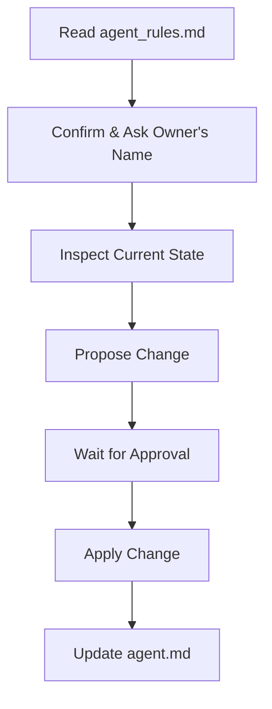

# Agent Rules & Collaboration Protocol

AI-assisted development often breaks down in predictable ways:
* **Unsanctioned Edits:** Changes get introduced without explicit review or approval.
* **Context Loss:** New sessions lack visibility into work completed by previous sessions.
* **Codebase Drift:** Unfinished refactors, dead code, and unverified assumptions accumulate over time.
* **Uncertain Verification:** Distinguishing between tested code and assumed functionality becomes impossible.

When every new AI session—or team member—starts from assumptions rather than a verified state, trust in the repository degrades. This document establishes standing operational rules for any AI assistant (Claude, ChatGPT, Copilot, Cursor, etc.) working on this repository to ensure all AI-generated work remains predictable, reversible, and auditable.

---

## Core Principles

| Principle | Enforcement Standard |
| :--- | :--- |
| **Approval Before Action** | Require explicit authorization prior to executing commands, installing dependencies, editing files, or altering architecture. |
| **Living Handoff Doc (`agent.md`)** | Maintain `agent.md` after every approved change, enabling subsequent AI sessions to resume work without re-analyzing the entire codebase. |
| **Preservation of Work** | Never silently overwrite, delete, or refactor existing functional code without authorization. |
| **Verified Results** | Run builds and tests only when authorized, reporting execution outputs as-is without assuming success. |
| **Binding Standard** | Protocol rules cannot be bypassed for convenience or speed. The sole exception is raising legitimate safety or ethical concerns. |

---

## Workflow Execution

| Step | Phase | Action Required |
| :---: | :--- | :--- |
| **1** | **Initialization** | Read `agent_rules.md`, confirm understanding of these rules, and request the project owner's preferred name once for future reference. |
| **2** | **Inspection** | Inspect current repository state and active files directly—never rely on implicit assumptions. |
| **3** | **Proposal** | Present detailed proposed changes (target files, sections, and exact modifications) and wait for explicit user approval before execution. |
| **4** | **Execution & Handoff** | Apply approved changes, then update `agent.md` with modified files, architectural decisions, current project state, known issues, and next tasks. |
| **5** | **State Tracking** | Structure `agent.md` into **Completed**, **In Progress**, **Pending**, and **Known Issues** with sufficient detail (branch state, verified status, open questions) for seamless context recovery or if you have existing work to hand off. |

---

---
## Maintainer
Lohit Devansh
